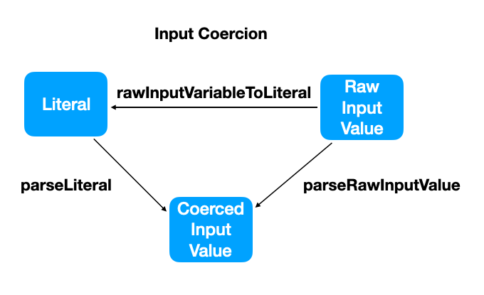

# GraphQL Scalars implementation guide

Scalar types are primitive types in the GraphQL type system, usable for input
and output.

## Serialization and Deserialization

A GraphQL request often requires a deserialization step before being executed
and and a serialization of the execution result. By far the most important
example is a GraphQL request send over HTTP POST via JSON. The request body is a
JSON document that needs to be deserialized containing the GraphQL document and
optionally an operation name and variables.

The execution result then is serialized to JSON for the HTTP response. Because
this JSON serialization is the most important GraphQL serialization the spec
clearly defines how a GraphQL result should be serialized to JSON. See the
[GraphQL spec](https://spec.graphql.org/draft/#sec-Serialization-Format).

For the discussion of Scalars the deserialization of the variables is
significant. Deserialized variable values are one of the possible input a Scalar
implementation need to handle.

## Observability

A Scalar implementation can be observed in three different ways: the serialized
result of an execution in JSON, the variables JSON input and the GraphQL literal
input. We need to choose a serialization format in order to observe a Scalar
implementation as inside the GraphQL type system a Scalar is a primitive and how
a Scalar is represented in an execution result before serialization is entirely
up to the specific engine. In theory JSON is just one possible serialization
format, but it is by far the most important and also the only format the GraphQL
spec clearly defines, therefore we choose to only consider JSON here.

## Coercion

The process of ensuring that a value is valid and optionally converting it into
a more appropriate representation is called "coercion". For Scalars specifically
there are two different coercion mechanism: "Result Coercion" and "Input
Coercion". Both are implemented as a set of functions taking an input and
producing an output. Result coercion consists of one function and input coercion
of up to three different ones. (Warning naming: the input of a function is not
to be confused with "Input Coercion". Input coercion refers to the overall
mechanism, but just "input" is what is consumed by a function.)

## Result Coercion

Result coercion is implemented as a single function per Scalar type called
"coerceResult". The input is a "raw result value" and the output a "coerced
result value". The raw result value is the output of a previously invoked
resolver function, which is then coerced by invoking `coerceResult`.

The coerced result value is a leaf value of the overall execution result which
is serialized to JSON. The serialized JSON value can be observed and a GraphQL
Scalar spec must clearly define the possible JSON values that a Scalar type can
produce.

## Input Coercion

Input coercion deals with three different kind of values: literal, raw input
value and coerced input value.

### Literal

A literal is an element of the GraphQL language representing a fixed value.
Examples are `"foo"` or `123` for `StringValue` and `IntValue` literals.
Literals are used for:

1. argument values for fields or directives

1. argument default values for fields or directives

1. variable default values of a GraphQL operation

### Raw Input Value

A raw input value is one of the following:

1. variable value for a GraphQL request

1. programmatically provided default argument value for a field or directive

1. programmatically provided default value for an input object field

1. programmatically provided value for a directive argument in a SDL

Not every GraphQL implementation may offer a programmatic way to provide these
input values, but every implementation needs to allow for raw input values
offered as variable values for a request.

The details of a raw input value is implementation specific. In JavaScript it
might a Map, in Java it might a object. The only way to observe a raw input
value is to through the not yet deserialized JSON value.

### Coerced Input Value

A coerced input value is a value that is ready for consumption by a resolver. It
is coerced either from a literal or raw input value.

Input coercion is implemented as a set of three functions `parseLiteral`,
`parseRawInputValue` and `rawInputValueToLiteral`.

### Parse Literal

`parseLiteral` takes a GraphQL language literal as input and produces a coerced
input value as output.

### Parse Raw Input Value

`parseRawInputValue` takes a "raw input value" as input and produces a "coerced
input value".

### Raw Input Value to Literal

`rawInputValueToLiteral` takes a raw input value as input and produces a GraphQL
language literal.

It is used when a literal representation of a raw input value is required. For
example the default value for a field in an Introspection response. If a GraphQL
implementation doesn’t provide a way to define a raw input value
programmatically, `rawInputValueToLiteral` might not be needed.

### Implementation rules

These three functions need to be compatible to each other, specifically:

**Rule 1:** every valid input for `parseRawInputValue` must be a valid input for
`rawInputVariableToLiteral` and vice versa. This rule ensure that every raw
input value can be represented as literal.

**Rule 2:** for every valid input for `parseLiteral` there must at least one
corresponding input for `parseRawInputValue` resulting in the same coerced input
value. This rule ensure that all literals can be represented as raw input value.

**Rule 3:** every output for `rawInputVariableToLiteral` must be a valid input
for `parseLiteral`

These rules ensure that for every valid literal we have at least one valid raw
value and vice versa.

### Coercion guidelines

While the specifics of the all coercion methods are implementation specific, as
a general they should only coerce a value when no information is lost and raise
an error otherwise.

Additionally, the input coercion should be liberal in what it accepts, while the
result coercion should be much more restricted and never different JSON values
for the same logically value.

For example a `MyLocalDate` scalar could accept the literals `"01-10-2022"` and
`"01102022"` as input for the first of October 2022, but the result coercion
should always return one of the possible representations.

## Scalars specification outline

A Scalars specification must clearly define the three observable aspects of a
Scalar:

1. The possible JSON result values

1. The possible literal input values

1. The possible JSON variable input values

Additionally, it is recommended to give positive and negative examples for each
of the values.

It is also recommend to give a recommended Scalar name.

Possible content outline:

- Background

- Naming recommendation

- Valid values

- Examples

- References
