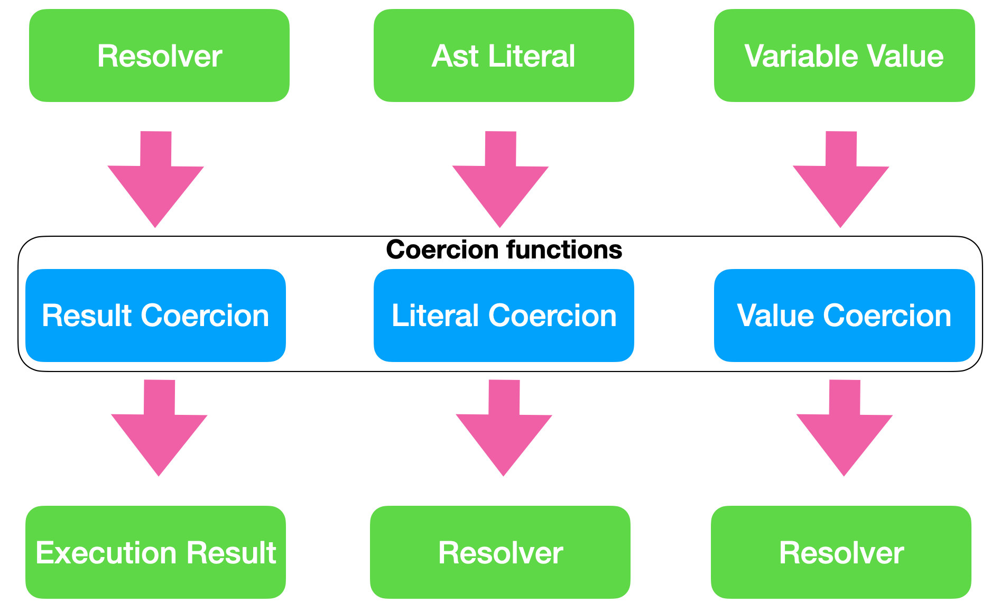
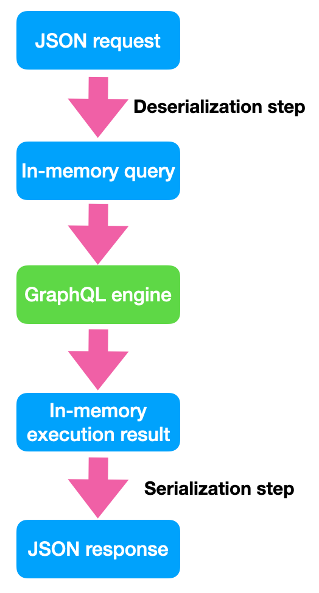

import { Link } from 'gatsby'
import Layout from '../components/layout'
import SEO from '../components/seo'

<SEO title="Guide to GraphQL Scalars" />

<h1>Reference guide to implement custom GraphQL Scalars</h1>

This is a reference which aims to be as complete as possible and which will be updated over time.<br/>
For an introduction see: [GraphQL Scalars in-depth](https://www.graphql.de/blog/scalars-in-depth/)

```toc
# This code block gets replaced with the TOC
```

# Preamble: Naming is hard

The [GraphQL specification](https://spec.graphql.org/) currently only refers to "Result Coercion" and 
"Input Coercion". 

In order to be more clear and precise this guide refers "Literal Coercion" and "Value Coercion" 
which are both two different "Input Coercion" in the spec terminology.

"Input" here means always the input of the Coercion functions (the argument of the functions) and not a 
specific Coercion function. The specific functions are always named "Result Coercion", "Literal Coercion" 
or "Value Coercion"

# Coercion functions

The fundamental job of a Scalar is to give type safety about the values which are returned or which can be used as input.

This type safety is implemented through three functions per Scalar. Each function is invoked at a specific time by the GraphQL engine. 
They all validate and convert a provided value. This conversion is called "Coercion" in GraphQL. 

Overview of the coercion functions:




Every function has an input and produces an output:


| Function      | Input | Output
| ------------- |-------------|------
| Result Coercion  | The result of a resolver.  | A leaf of the overall execution result.
| Literal Coercion | An abstract syntax tree (Ast)  Literal | Is provided to an resolver as argument. 
| Value Coercion | A value which is provided as a variable value. | Is provided to an resolver as argument.


## Result Coercion 

Result Coercion takes the result of a resolver and converts it into an appropriate value for the result.

This result value is NOT the serialized value. Serialization is an extra step.

## Literal Coercion 

Literal Coercion takes an abstract syntax tree (Ast) element from a schema definition or query and converts it into an appropriate 
argument value for a resolver.

Literal values can be arbitrary Ast elements: Strings, Ints, Enum names or Input Objects. 

There are no restrictions beside syntax. For example am Ast element can be `1234568901234567890` which 
is actually not a valid  Integer (it is to big) but it is a valid Ast element. 

Ast elements can even be complex input objects like `{foo: "String", bar: 1234}`.

## Value Coercion 

Value Coercion takes a runtime values (which come from variables) and convert it into an appropriate value for a resolver.

Variables are provided along with the actual query to the engine for execution. These values are often deserialized from JSON before
provided to the engine.

# Serialization 

Serialization is the process of taking some in-memory values and converting them into an appropriate format for 
sending over a network or storing somewhere. Deserialization is the opposite: taking some format which comes from a network request
and constructing an in-memory value from it.

A typical GraphQL request against a GraphQL service accepts JSON as serialization format and produces JSON:



A GraphQL request in JSON consists of:

```JSON
{ 
    "query": "..." 
    "operationName": "..."
    "variables": {...}
}
```
This JSON is then deserialized into an in-memory representation. The details how this in-memory structure 
looks depend very much on the language you using.  

This values are then used to passed into the GraphQL engine to execute the request.

The result of the overall execution is an in-memory execution result which is then serialized to JSON:

```JSON
{ 
    "data": {...} 
    "errors": [...]
}
```

## Result Coercion: Serialize or not

(De)Serialization does not need to be complicated, but can be rather trivial for
primitive types like string or boolean. 

For Result Coercion this leaves the option of implementing the serialization into the function directly
or returning a more complex value which then will be serialized later.

For example for a `Date` scalar in JS the Result Coercion could 
return a `Date` value or directly a formatted string.

Both solutions are viable with certain tradeoffs:

If the Result Coercion already returns a serialized value the Scalar is easier to
use and the result is more predictable.

On the other hand the serialization is less configurable and the Scalar 
might not be useable for non JSON serialization use cases.   

It might be worth to offer both solution and let the user of the Scalar decide.


# Implementation guidelines  

## Observable or not

Not every aspect of every coercion function is observable by a GraphQL consumer. 

The input of Result Coercion and the outputs of Literal and Value Coercion are implementation details 
of the GraphQL engine.

But the input of Literal and Value Coercion and the output of Result Coercion are observable, meaning 
any change to it are affecting GraphQL consumers and can break the API contract.

| Function      | Input observable? | Output observable?
| ------------- |-------------|--
| Result Coercion  | No | Yes (after serialziation)
| Literal Coercion | Yes | No
| Value Coercion | Yes (after deserialization) | No

For custom Scalar specifications this means it is especially important to specify

- Result Coercion Output
- Literal Coercion Input
- Value Coercion Input

while the other inputs and outputs are left to the implementation and only some general recommendations
can be provided.


## Flexible Input

The input of each coercion function should be flexible to make the usage of the Scalar as convenient 
as possible.

There is a fine line between being flexible and too flexible which might lead to unexpected behavior.  

Unexpected behavior happens when a Scalar accepts an input and converts it to an value in an surprising way.

For example a `Long` Scalar accepting a String like `"1234Foo"` and converting it to `1234` is 
probably not a good idea. 

On the other hand GraphQL.js accepts any `number` as input for the built-in `Boolean` Scalar and converts every non
zero value to `true`. This might be ok for JavaScript while other languages can choose to be more strict.

## Literal and Value Coercion should be consistent

Because Literal and Value Coercion outputs are both provided to resolvers as arguments they 
should produce the same values for the same logical values.

## Document JSON serialization

JSON is by far the most important Serialization format for GraphQL. Every custom Scalar should 
clearly document how it is suppose to be (de)serialized from/to JSON. 

# Language specific guides

General hint: 
The concepts presented above are valid for all GraphQL implementations,
but the details might differ. Especially the naming of the coercion function is not consistent
across eco systems.

## JavaScript

https://www.graphql.de/blog/scalars-in-depth/

https://www.apollographql.com/docs/graphql-tools/scalars/


## Ruby
https://www.abhaynikam.me/posts/custom-scalar-in-graphql-ruby/


## Python

https://docs.graphene-python.org/en/latest/types/scalars/#custom-scalars

## .NET

https://hotchocolate.io/docs/0.5.2/custom-scalar-types (Hot chocolate)

Please raise a [Pull Request](https://github.com/andimarek/graphql-scalars.com/) to add 
links to more language specific guides.


